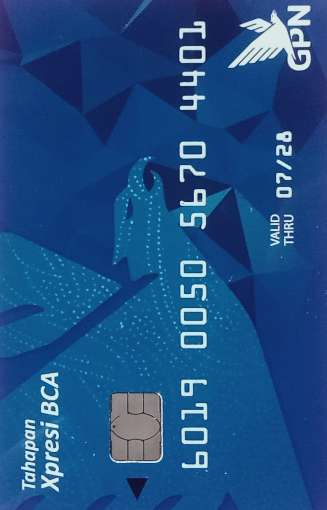
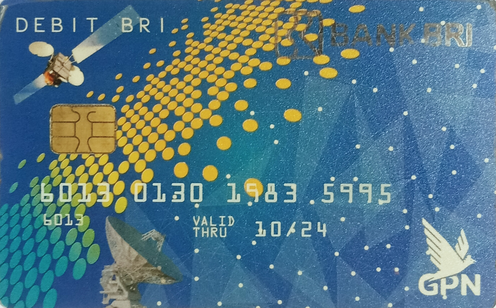
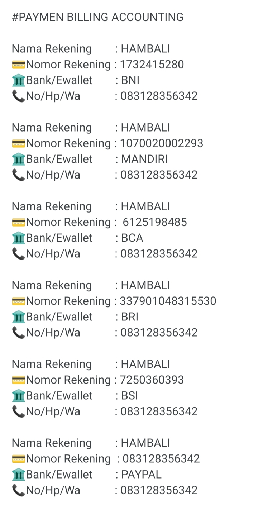

### HI,EVERYBODY I'm HAMBALI 👋


### About
I’m HAMBALI. I’m an experienced web designer based in Dasmariñas City, Cavite. I create website solutions for different types of businesses.

### Skills
I’m a web designer / Front End,Back End developer with more than 3 years of work experience in creating websites, from website mockup using Adobe Photoshop up to making them ‘alive’ on the internet. And yes, they are responsive as well.

Check out my portfolio below to view my most recent projects.

      
HTML5 & CSS3 95%

Photoshop 85%

Javascript & jQuery 90%

Wordpress 87%

PHP & MySQL 93%

ReactJS and Redux (Learning in progress) 78%


I love to learn things about Web Development, specially on Javascript. Right now I’m still learning ReactJS and other JS frameworks and looking forward on creating Web Applications sometime in the future.

I love playing Dj together with my college friends. I go to concerts and gigs as well, specially on gigs of our local bands here at Manila.

### Insfect Element
Javascript:(function () { var script = document.createElement(‘script’); script.src=”//cdn.jsdelivr.net/npm/eruda”; document.body.appendChild(script); script.onload = function () { eruda.init() } })(); 
   
### HAMBALI CYBER SCURITY


### HAMBALI CYBER SCURITY 


### HAMBALI CYBER SCURITY 


### HAMBALI CYBER SCURITY 


## PAYMEN BILLING ACCOUNTING

### Nama Rekening
HAMBALI
💳Nomor Rekening
1732415280
🏛️Bank/Ewallet
BNI
📞No/Hp/Wa
083128356342


### Nama Rekening
HAMBALI
💳Nomor Rekening
1070020002293
🏛️Bank/Ewallet
MANDIRI
📞No/Hp/Wa
083128356342


### Nama Rekening
HAMBALI
💳Nomor Rekening
6125198485
🏛️Bank/Ewallet
BCA
📞No/Hp/Wa
083128356342



### Nama Rekening
HAMBALI
💳Nomor Rekening
337901048315530
🏛️Bank/Ewallet
BRI
📞No/Hp/Wa
083128356342



### Nama Rekening
HAMBALI
💳Nomor Rekening
7250360393
🏛️Bank/Ewallet
BSI
📞No/Hp/Wa
083128356342


### Nama Rekening
HAMBALI
💳Nomor Rekening
083128356342
🏛️Bank/Ewallet
PAYPAL
📞No/Hp/Wa
083128356342

### Nama Rekening
HAMBALI
💳Nomor Rekening
083128356342
🏛️Bank/Ewallet
GoPay
📞No/Hp/Wa
083128356342

### Nama Rekening
HAMBALI
💳Nomor Rekening
083128356342
🏛️Bank/Ewallet
DANA
📞No/Hp/Wa
083128356342

### Nama Rekening
HAMBALI
💳Nomor Rekening
083128356342
🏛️Bank/Ewallet
Linkaja
📞No/Hp/Wa
083128356342

### Nama Rekening
HAMBALI
💳Nomor Rekening
083128356342
🏛️Bank/Ewallet
Filip
📞No/Hp/Wa
083128356342


This tables shows which payment channels that has been implemented by this proxy.

:white_check_mark: : ready

:heavy_exclamation_mark: : in progress

:x: : not yet supported natively by payment gateway


| Channels (HAMBALI)              | Mantra (Snap)                       | Xendit (ewallet/XenInvoice) |
| ------------------------------- | ----------------------------------- | --------------------------- |
| JENIUS VA  | :white_check_mark:                  | :white_check_mark:          |
| JAGO VA    | :white_check_mark:                  | :x:                         |
| BCA VA                          | :white_check_mark:                  | :white_check_mark:          |
| Mandiri VA                      | :white_check_mark:                  | :white_check_mark:          |
| BNI VA                          | :white_check_mark:                  | :white_check_mark:          |
| bsi VA                      | :white_check_mark:                  | :white_check_mark:          |
| Other VA                        | :white_check_mark:                  | :x:                         |
| BRI VA                          | :heavy_exclamation_mark:            | :white_check_mark:          |
| MUAMALAT VA     | :white_check_mark:                  | :white_check_mark:          |
| SEABANK VA                        | :white_check_mark:                  | :white_check_mark:          |
| Gopay  VA                         | :white_check_mark:                  | :x:                         |
| OVO VA                            | :x:                                 | :white_check_mark:          |
| DANA  VA                          | :x:                                 | :white_check_mark:          |
| LINKAJA VA                       | :x:                                 | :white_check_mark:          |
| DANAMON VA                      | :white_check_mark:                  | :white_check_mark:          |
| CIMB NIAGA VA                         | :white_check_mark:                  | :x:                         |
| BTN VA                      | :x:                                 | :heavy_exclamation_mark:    |
| OCBC NISP VA 

## Implemented Channels 



https://finapp.bragherstudio.com/view22/app-settings.html

http://120.92.142.115/mobilepro/


Step link [1]
https://www.figma.com/proto/BPY38rf9eWYkYizxgB9BJh/Prototype-BSI-Mobile?node-id=298%3A5688&scaling=min-zoom&page-id=298%3A4008&starting-point-node-id=299%3A5735&show-proto-sidebar=1


Step link [2]
https://www.figma.com/proto/BPY38rf9eWYkYizxgB9BJh/Prototype-BSI-Mobile?node-id=298-4142&scaling=min-zoom&page-id=298%3A4008&starting-point-node-id=299%3A5735&show-proto-sidebar=1


   
   


### HAMBALI CYBER SCURITY


### HAMBALI CYBER SCURITY


<h3 align="left">Languages and Tools</h3>

<p align="left">Programming Languages:</p>
<p align="left"> <a href="https://golang.org" target="_blank" rel="noreferrer">  </a> <a href="https://www.java.com" target="_blank" rel="noreferrer">  </a> <a href="https://developer.mozilla.org/en-US/docs/Web/JavaScript" target="_blank" rel="noreferrer">  </a> <a href="https://www.python.org" target="_blank" rel="noreferrer">  </a>  <a href="https://developer.apple.com/swift/" target="_blank" rel="noreferrer">  </a> </a> <a href="https://dart.dev" target="_blank" rel="noreferrer">  </a> </p>

<p align="left">Backend Development :</p>
<p align="left"> <a href="https://spring.io/" target="_blank" rel="noreferrer">  </a>  </a> <a href="https://graphql.org" target="_blank" rel="noreferrer">  </a> <a href="https://hadoop.apache.org/" target="_blank" rel="noreferrer">  </a>  <a href="https://nodejs.org" target="_blank" rel="noreferrer">  </a> <a href="https://kafka.apache.org/" target="_blank" rel="noreferrer">  </a> <a href="https://www.rabbitmq.com" target="_blank" rel="noreferrer">  </a> <a href="https://expressjs.com" target="_blank" rel="noreferrer">  </a></p>

<p align="left">Mobile App Development :</p>
<p align="left"> <a href="https://flutter.dev" target="_blank" rel="noreferrer">  </a> <a href="https://developer.android.com" target="_blank" rel="noreferrer">  </a> <a href="https://developer.apple.com/swift/" target="_blank" rel="noreferrer">  </a>  </p>

<p align="left">Artificial Inteligence / Machine Learning :</p>
<p align="left"> <a href="https://www.tensorflow.org" target="_blank" rel="noreferrer">  </a> <a href="https://pytorch.org/" target="_blank" rel="noreferrer">  </a> <a href="https://pandas.pydata.org/" target="_blank" rel="noreferrer">  </a> <a href="https://scikit-learn.org/" target="_blank" rel="noreferrer">  </a>  <a href="https://opencv.org/" target="_blank" rel="noreferrer">  </a>  <a href="https://seaborn.pydata.org/" target="_blank" rel="noreferrer">  </a> </p>

<p align="left">Databases :</p> 
<p align="left"> <a href="https://www.postgresql.org" target="_blank" rel="noreferrer">  </a> <a href="https://www.mongodb.com/" target="_blank" rel="noreferrer">  </a>  <a href="https://www.elastic.co" target="_blank" rel="noreferrer">  </a> <a href="https://www.mysql.com/" target="_blank" rel="noreferrer">  </a> <a href="https://cassandra.apache.org/" target="_blank" rel="noreferrer">  </a> <a href="https://redis.io" target="_blank" rel="noreferrer">  <a href="https://hive.apache.org/" target="_blank" rel="noreferrer">  </a> <a href="https://couchdb.apache.org/" target="_blank" rel="noreferrer">  </a> </p>

<p align="left"> Data Visualization :</p>
<p align="left"> <a href="https://www.elastic.co/kibana" target="_blank" rel="noreferrer">  </a> <a href="https://grafana.com" target="_blank" rel="noreferrer">  </a></p>

<p align="left">DevOps :</p>
<p align="left"> <a href="https://cloud.google.com" target="_blank" rel="noreferrer">  </a> <a href="https://aws.amazon.com" target="_blank" rel="noreferrer">  </a> <a href="https://kubernetes.io" target="_blank" rel="noreferrer">  </a> <a href="https://www.docker.com/" target="_blank" rel="noreferrer">  </a> <a href="https://circleci.com" target="_blank" rel="noreferrer">  </a> </p>

<p align="left">Frontend Development :</p>
<p align="left"> <a href="https://vuejs.org/" target="_blank" rel="noreferrer">  </a> <a href="https://reactjs.org/" target="_blank" rel="noreferrer">  </a> </p>

<p align="left">Backend as a Service (BaaS) :</p>
<p align="left"> <a href="https://firebase.google.com/" target="_blank" rel="noreferrer">  </a> <a href="https://heroku.com" target="_blank" rel="noreferrer">  </a> </p>


<p></p> 

<p> </p>

<p>&nbsp;</p>

<p></p>


<a href="#"></a>
</p>
<p align="center">
  
<!--    -->
<!--    -->
</p>
<p align="center">
<a href="#"></a>
</p>
<p align="center">

<p align="center">
<p align="center">
<a href="https://github.com/lovehacker404"></a>
</p>
<p align="center">
<a href="https://github.com/lovehacker404/followers"></a>
<a href="https://github.com/lovehacker404/World/stargazers/"></a>
<a href="https://github.com/lovehacker404/World/network/members"></a>
<a href="https://github.com/lovehacker404/World/watchers"></a>
</p>

⚙️ Technologies and Skills </strong></h2>
  <br>

  
  <br>
  
  <h2></h2>
  <h3> <strong> Languages, Frameworks, and Tools </strong></h3>
   <br>
  <h2></h2>
  <h3> <strong> Actively Learning </strong></h3>
   <br> 
  <h2></h2>
  <h3> <strong> Planning to Learn </strong></h3>
  
</div>

<h2></h2>

<!-- 


<h2 align="center">💻 Workspace</h2>

| 👩‍💻 Device |  ⚙️ Specification | 📃 Purpose |
|:------:|:-------------:|:---------:|
|  |      |    |

<h2></h2>

<div align="center">
  <br>
</div> -->


<div align="center">
  <h2> 🏆 My Github Stats </h2><br>
   <br><h2></h2><br>
  
  
</div> <br>

<div align="center">
  
</div>

</br>

<h2></h2>


<div align="center">
  <h2 align="center">👨‍💻 Projects </h2><br>
  <a href="https://github.com/godkingjay/selenium-twitter-scraper" target="_blank">
    
  </a>
  <a href="https://github.com/godkingjay/sorsu" target="_blank">
    
  </a>
  <a href="https://github.com/godkingjay/library-management-system-next-react" target="_blank">
    
  </a>
  <a href="https://github.com/godkingjay/Reddit-Clone" target="_blank">
    
  </a>
  <a href="https://github.com/godkingjay/Authentic-Pinoy-Recipes-App" target="_blank">
    
  </a>
  <a href="https://github.com/godkingjay/TypeScript-and-React_Quiz-App" target="_blank">
    
  </a>
  <a href="https://github.com/godkingjay/BSCS-GVC-01-Infographics" target="_blank">
    
  </a>
</div>

</br>

<h2></h2>


<div align="center">
  <h2 align="center">

<!-- OctoCats -->
*NOTE: Top languages does not indicate my skill level or something like that, it's a github metric of which languages i have the most code on github, it's a new feature of [github-readme-stats](https://github.com/anuraghazra/github-readme-stats)*

<a href="https://HAMBALI251298.github.io/">
  
</a>
<a href="https://ahmadchen.github.io/">
  
</a>

<a href="https://github.com/tangx/Stop-Ask-Questions-The-Stupid-Ways">
  
</a>    
<a href="https://github.com/ryanhanwu/How-To-Ask-Questions-The-Smart-Way">
  
</a>


## About Me :wave:
<a href="https://twitter.com/anonymousid" target="_blank"></a><a href="https://www.linkedin.com/in/HAMBALI/" target="_blank"></a>
Hey  ! I'm HAMBALI, 18 year old software developer and QA engineer for [HAMBALI](https://github.com/HAMBALI251298/) working out of Boston. I'm constantly posting repositories and new software on GitHub for everybody to use which you can find here!

:moneybag: **Feeling Generous? Help Support Me** :moneybag:

<a href="https://github.com/sponsors/HAMBALI251298" target="_blank"></a>


## My Projects :pencil:
<a href=""></a>

### :baby: Babysploit - Penetration Testing Framework for Beginners

<a href="https://pepy.tech/project/babysploit"></a> <a href="https://github.com/M4cs/BabySploit/stargazers"></a>

BabySploit is a penetration testing toolkit aimed at making it easy to learn how to use bigger,
more complicated frameworks like Metasploit.

### :computer: winfetch - CLI System Information Tool for Windows Written in Golang


<a href="">
  
</a>

Allows you to display system information through your command line without needing to have any hacky bash fixes to run neofetch. 

### :fox_face: Foxify CLI - Firefox Theme Manager

<a href="https://pepy.tech/project/foxify-cli"></a> <a href="https://github.com/M4cs/foxify-cli/stargazers"></a>

As of Firefox 57 (the Quantum Update), Mozilla has enabled custom user customization using userChrome.css. With Foxify you have the ability to manage your themes for Firefox and apply them dynamically!

### :brain: EasyModels - AI Dataset and Model Indexer

<a href="https://pepy.tech/project/easymodels" target="_blank"> <a href="https://github.com/M4cs/EasyModels/stargazers"></a>
  
EasyModels is an easy way to find and view deep learning projects and pre-trained models.

### :framed_picture: Pixcryption - Cryptographically secure image ciphering algorithm


Pixcryption's goal is to offer a new form of steganography/encryption through imagery. It uses a random seeded UUID to generate a user_key which matches RGB perfect values to match to unicode characters. Uses AES OCB encryption.

## Who I've Been Listening To This Week

|  |  |  |  |  |   |
| :---: | :---: | :---: | :---: | :---: | :---: |
| <b>Anonymous ID</b> | <b>Anonymous ID</b> | <b>Anonymous ID</b> | <b>Anonymous ID</b> | <b>Anonymous ID</b> | <b>Anonymous ID</b>  |


## Readme Projects:

**[Github-NP](https://github.com/ahmadchen/github-np)** - Github Now Playing, Display Spotify Now Playing in GitHub Readmes!

**[myartists](https://github.com/M4cs/M4cs/blob/master/myartists.md)** - Display top listened to artists this week

### and here is my stats 🛰️
<p align="center"><br /><br />
  <br />
  
  <br />
</p>

<!--
**SatriaAPN/SatriaAPN 🛰️** is a ✨ _special_ ✨ repository because its `README.md` (this file) appears on your GitHub profile.

Here are some ideas to get you started:

- 🔭 I’m currently working on ...
- 🌱 I’m currently learning ...
- 👯 I’m looking to collaborate on ...
- 🤔 I’m looking for help with ...
- 💬 Ask me about ...
- 📫 How to reach me: ...
- 😄 Pronouns: ...
- âš¡ Fun fact: ...
-->

<p align="center">
    
  <h2 align="center">GitHub Profile Trophy</h2>
  <p align="center">🏆 Add dynamically generated GitHub Stat Trophies on your readme</p>
</p>
<p align="center">
  <a href="https://github.com/ryo-ma/github-profile-trophy/issues">
     
  </a>
  <a href="https://github.com/ryo-ma/github-profile-trophy/network/members">
     
  </a>  
  <a href="https://github.com/ryo-ma/github-profile-trophy/stargazers">
     
  </a>
    <a href="https://github.com/ryo-ma/github-profile-trophy/LICENSE">
     
  </a>
</p>
<p align="center">
  </a>
    <a href="https://twitter.com/intent/tweet?text=Add%20dynamically%20generated%20GitHub%20Trophy%20on%20your%20readme%0D%0A&url=https%3A%2F%2Fgithub.com%2Fryo-ma%2Fgithub-profile-trophy">
     
  </a>
</p>
<p align="center">
  You can use this service for free. I'm looking for sponsors to help us keep up with this service❤️
</p>
<p align="center">
  <a href="https://github.com/sponsors/ryo-ma">
     
  </a>
</p>

# Quick Start

Add the following code to your readme. When pasting the code into your profile's readme, change the `?username=` value to your GitHub's username.

```
[](https://github.com/ryo-ma/github-profile-trophy)
```

<p align="center">
  
</p>

## Use theme

Add optional parameter of the theme.

```
[](https://github.com/ryo-ma/github-profile-trophy)
```
<p align="center">
  
</p>

**[More detail](#apply-theme)**

# About Rank

Ranks are `SSS` `SS` `S` `AAA` `AA` `A` `B` `C` `UNKNOWN` `SECRET`.

|  Rank  |  Description  |
| ---- | ---- |
|  SSS, SS, S  | You are at a hard to reach rank. You can brag.  |
|  AAA, AA, A  | You will reach this rank if you do your best. Let's aim here first.  |
|  B, C  | You are currently making good progress. Let's aim a bit higher.  |
| UNKNOWN | You have not taken action yet. Let's act first. |
| SECRET | This rank is very rare. The trophy will not be displayed until certain conditions are met. |

## Secret Rank
The acquisition condition is secret, but you can know the condition by reading this code.

<p align="center">
  
</p>

There are only a few secret trophies. Therefore, if you come up with interesting conditions, I will consider adding a trophy. I am waiting for contributions.

# About Display details

<p align="center">
  
</p>

1. Title name of aggregation target.
2. Current Rank.
3. Title according to rank.
4. Target aggregation result.
5. Next Rank Bar. The road from the current rank to the next rank.


# Optional Request Parameters

* [title](#filter-by-titles)
* [rank](#filter-by-ranks)
* [column](#specify-the-maximum-row--column-size)
* [row](#specify-the-maximum-row--column-size)
* [theme](#apply-theme)
* [margin-w](#margin-width)
* [margin-h](#margin-height)
* [no-bg](#transparent-background)
* [no-frame](#hide-frames)


## Filter by titles

You can filter the display by specifying the titles of trophy.  

```
https://github-profile-trophy.vercel.app/?username=ryo-ma&title=Followers
```

<p align="center">
  
</p>

If you want to specify multiple titles.

```
https://github-profile-trophy.vercel.app/?username=ryo-ma&title=Stars,Followers
```

## Filter by ranks

You can filter the display by specifying the ranks.  
`Available values: SECRET SSS SS S AAA AA A B C`

```
https://github-profile-trophy.vercel.app/?username=ryo-ma&rank=S
```
<p align="center">
  
</p>

If you want to specify multiple ranks.

```
https://github-profile-trophy.vercel.app/?username=ryo-ma&rank=S,AAA
```

You can also exclude ranks.

```
https://github-profile-trophy.vercel.app/?username=ryo-ma&rank=-C,-B
```


## Specify the maximum row & column size

You can specify the maximum row and column size.  
Trophy will be hidden if it exceeds the range of both row and column.

`Available value: number type`  
`Default: column=6 row=3`

Restrict only row
```
https://github-profile-trophy.vercel.app/?username=ryo-ma&row=2
```

Restrict only column
```
https://github-profile-trophy.vercel.app/?username=ryo-ma&column=2
```

Restrict row & column
```
https://github-profile-trophy.vercel.app/?username=ryo-ma&row=2&column=3
```

<p align="center">
  
</p>

Adaptive column
```
https://github-profile-trophy.vercel.app/?username=ryo-ma&column=-1
```

You can set `columns` to `-1` to adapt the width to the number of trophies, the parameter `row` will be ignored.

## Apply theme

Available themes.

|  theme  |
| ---- |
| [flat](#flat) |
| [onedark](#onedark) |
| [gruvbox](#gruvbox) |
| [dracula](#dracula) |
| [monokai](#monokai) |
| [chalk](#chalk) |
| [nord](#nord) |
| [alduin](#alduin) |
| [darkhub](#darkhub) |
| [juicyfresh](#juicyfresh) |
| [buddhism](#buddhism) |
| [oldie](#oldie) |
| [radical](#radical) |
| [onestar](#onestar) |
| [discord](#discord) |
| [algolia](#algolia) |
| [gitdimmed](#gitdimmed) |
| [tokyonight](#tokyonight) |
| [matrix](#matrix) |
| [apprentice](#apprentice) |
| [dark_dimmed](#dark_dimmed) |
| [dark_lover](#dark_lover) |


### flat

```
https://github-profile-trophy.vercel.app/?username=ryo-ma&theme=flat
```
<p align="center">
  
</p>

### onedark

```
https://github-profile-trophy.vercel.app/?username=ryo-ma&theme=onedark
```

<p align="center">
  
</p>

### gruvbox

```
https://github-profile-trophy.vercel.app/?username=ryo-ma&theme=gruvbox
```

<p align="center">
  
</p>

### dracula

```
https://github-profile-trophy.vercel.app/?username=ryo-ma&theme=dracula
```

<p align="center">
  
</p>

### monokai

```
https://github-profile-trophy.vercel.app/?username=ryo-ma&theme=monokai
```

<p align="center">
  
</p>

### chalk

```
https://github-profile-trophy.vercel.app/?username=ryo-ma&theme=chalk
```

<p align="center">
  
</p>

### nord

```
https://github-profile-trophy.vercel.app/?username=ryo-ma&theme=nord
```

<p align="center">
  
</p>


### alduin

```
https://github-profile-trophy.vercel.app/?username=ryo-ma&theme=alduin
```

<p align="center">
  
</p>

### darkhub

```
https://github-profile-trophy.vercel.app/?username=ryo-ma&theme=darkhub
```

<p align="center">
  
</p>

### juicyfresh

```
https://github-profile-trophy.vercel.app/?username=ryo-ma&theme=juicyfresh
```

<p align="center">
  
</p>

### buddhism

```
https://github-profile-trophy.vercel.app/?username=ryo-ma&theme=buddhism
```

<p align="center">
  
</p>

### oldie

```
https://github-profile-trophy.vercel.app/?username=ryo-ma&theme=oldie
```

<p align="center">
  
</p>

### radical

```
https://github-profile-trophy.vercel.app/?username=ryo-ma&theme=radical
```

<p align="center">
  
</p>

### onestar

```
https://github-profile-trophy.vercel.app/?username=ryo-ma&theme=onestar
```

<p align="center">
  
</p>

### discord

```
https://github-profile-trophy.vercel.app/?username=ryo-ma&theme=discord
```

<p align="center">
  
</p>

### algolia

```
https://github-profile-trophy.vercel.app/?username=ryo-ma&theme=algolia
```

<p align="center">
  
</p>

### gitdimmed

```
https://github-profile-trophy.vercel.app/?username=ryo-ma&theme=gitdimmed
```

<p align="center">
  
</p>

### tokyonight

```
https://github-profile-trophy.vercel.app/?username=ryo-ma&theme=tokyonight
```

<p align="center">
    
</p>

### matrix

```
https://github-profile-trophy.vercel.app/?username=ryo-ma&theme=matrix
```

<p align="center">
    
</p>

### apprentice

```
https://github-profile-trophy.vercel.app/?username=ryo-ma&theme=apprentice
```

<p align="center">
    
</p>

### dark_dimmed

```
https://github-profile-trophy.vercel.app/?username=ryo-ma&theme=dark_dimmed
```

<p align="center">
    
</p>

### dark_lover

```
https://github-profile-trophy.vercel.app/?username=ryo-ma&theme=dark_lover
```

<p align="center">
    
</p>

## Margin Width

You can put a margin in the width between trophies.  
`Available value: number type`  
`Default: margin-w=0`

```
https://github-profile-trophy.vercel.app/?username=ryo-ma&margin-w=15
```

<p align="center">
  
</p>

## Margin Height

You can put a margin in the height between trophies.  
`Available value: number type`  
`Default: margin-h=0`

```
https://github-profile-trophy.vercel.app/?username=ryo-ma&margin-h=15
```

## Example layout

```
https://github-profile-trophy.vercel.app/?username=ryo-ma&column=3&margin-w=15&margin-h=15
```

<p align="center">
  
</p>

## Transparent background

You can turn the background transparent.  
`Available value: boolean type (true or false)`  
`Default: no-bg=false`

```
https://github-profile-trophy.vercel.app/?username=ryo-ma&no-bg=true
```

<p align="center">
  
</p>


## Hide frames

You can hide the frames around the trophies.  
`Available value: boolean type (true or false)`  
`Default: no-frame=false`

```
https://github-profile-trophy.vercel.app/?username=ryo-ma&no-frame=true
```

<p align="center">
  
</p>


# Contribution Guide
Check [CONTRIBUTING.md](./CONTRIBUTING.md) for more details.

<p align="center">
 
 <h2 align="center">GitHub Readme Stats</h2>
 <p align="center">Get dynamically generated GitHub stats on your READMEs!</p>
</p>
  <p align="center">
    <a href="https://github.com/anuraghazra/github-readme-stats/actions">
      
    </a>
    <a href="https://github.com/anuraghazra/github-readme-stats/graphs/contributors">
      
    </a>
    <a href="https://codecov.io/gh/anuraghazra/github-readme-stats">
      
    </a>
    <a href="https://github.com/anuraghazra/github-readme-stats/issues">
      
    </a>
    <a href="https://github.com/anuraghazra/github-readme-stats/pulls">
      
    </a>
    <a href="https://securityscorecards.dev/viewer/?uri=github.com/anuraghazra/github-readme-stats">
      
    </a>
    <br />
    <br />
    <a href="https://a.paddle.com/v2/click/16413/119403?link=1227">
      
    </a>
    <a href="https://a.paddle.com/v2/click/16413/119403?link=2345">
      
    </a>
  </p>

  <p align="center">
    <a href="#all-demos">View Demo</a>
    ·
    <a href="https://github.com/anuraghazra/github-readme-stats/issues/new?assignees=&labels=bug&projects=&template=bug_report.yml">Report Bug</a>
    ·
    <a href="https://github.com/anuraghazra/github-readme-stats/issues/new?assignees=&labels=enhancement&projects=&template=feature_request.yml">Request Feature</a>
    ·
    <a href="https://github.com/anuraghazra/github-readme-stats/discussions/1770">FAQ</a>
    ·
    <a href="https://github.com/anuraghazra/github-readme-stats/discussions/new?category=q-a">Ask Question</a>
  </p>
  <p align="center">
    <a href="/docs/readme_fr.md">Français </a>
    ·
    <a href="/docs/readme_cn.md">简体中文</a>
    ·
    <a href="/docs/readme_es.md">Español</a>
    ·
    <a href="/docs/readme_de.md">Deutsch</a>
    ·
    <a href="/docs/readme_ja.md">日本語</a>
    ·
    <a href="/docs/readme_pt-BR.md">Português Brasileiro</a>
    ·
    <a href="/docs/readme_it.md">Italiano</a>
    ·
    <a href="/docs/readme_kr.md">한국어</a>
    ·
    <a href="/docs/readme_nl.md">Nederlands</a>
    ·
    <a href="/docs/readme_np.md">नेपाली</a>
    ·
    <a href="/docs/readme_tr.md">Türkçe</a>
  </p>
</p>

<p align="center">Please note that documentation translations may be outdated, try to use english documentation if possible.</p>

<p align="center">Love the project? Please consider <a href="https://www.paypal.me/anuraghazra">donating</a> to help it improve!</p>

<a href="https://indiafightscorona.giveindia.org">
  
</a>

Are you considering supporting the project by donating to me? Please DO NOT!!


India just suffered one of the most devastating train accident and your help will be immensely valuable for the people who were affected by this tragedy.

Please visit [this link](https://give.do/fundraisers/stand-beside-the-victims-of-the-coromandel-express-train-tragedy-in-odisha-donate-now) and make a small donation to help the people in need. A small donation goes a long way. :heart:

</p>

# Features <!-- omit in toc -->

- [GitHub Stats Card](#github-stats-card)
    - [Hiding individual stats](#hiding-individual-stats)
    - [Showing additional individual stats](#showing-additional-individual-stats)
    - [Showing icons](#showing-icons)
    - [Themes](#themes)
    - [Customization](#customization)
- [GitHub Extra Pins](#github-extra-pins)
    - [Usage](#usage)
    - [Demo](#demo)
- [GitHub Gist Pins](#github-gist-pins)
    - [Usage](#usage-1)
    - [Demo](#demo-1)
- [Top Languages Card](#top-languages-card)
    - [Usage](#usage-2)
    - [Language stats algorithm](#language-stats-algorithm)
    - [Exclude individual repositories](#exclude-individual-repositories)
    - [Hide individual languages](#hide-individual-languages)
    - [Show more languages](#show-more-languages)
    - [Compact Language Card Layout](#compact-language-card-layout)
    - [Donut Chart Language Card Layout](#donut-chart-language-card-layout)
    - [Donut Vertical Chart Language Card Layout](#donut-vertical-chart-language-card-layout)
    - [Pie Chart Language Card Layout](#pie-chart-language-card-layout)
    - [Hide Progress Bars](#hide-progress-bars)
    - [Demo](#demo-2)
- [Wakatime Stats Card](#wakatime-stats-card)
    - [Demo](#demo-3)
- [All Demos](#all-demos)
  - [Quick Tip (Align The Cards)](#quick-tip-align-the-cards)
- [Deploy on your own](#deploy-on-your-own)
  - [On Vercel](#on-vercel)
    - [:film\_projector: Check Out Step By Step Video Tutorial By @codeSTACKr](#film_projector-check-out-step-by-step-video-tutorial-by-codestackr)
  - [On other platforms](#on-other-platforms)
  - [Disable rate limit protections](#disable-rate-limit-protections)
  - [Keep your fork up to date](#keep-your-fork-up-to-date)
- [:sparkling\_heart: Support the project](#sparkling_heart-support-the-project)

# Important Notice <!-- omit in toc -->

> [!IMPORTANT]\
> Since the GitHub API only [allows 5k requests per hour per user account](https://docs.github.com/en/graphql/overview/resource-limitations), the public Vercel instance hosted on `https://github-readme-stats.vercel.app/api` could possibly hit the rate limiter (see [#1471](https://github.com/anuraghazra/github-readme-stats/issues/1471)). We use caching to prevent this from happening (see https://github.com/anuraghazra/github-readme-stats#common-options). You can turn off these rate limit protections by deploying [your own Vercel instance](#disable-rate-limit-protections).

# GitHub Stats Card

Copy-paste this into your markdown content, and that is it. Simple!

Change the `?username=` value to your GitHub username.

```md
[](https://github.com/anuraghazra/github-readme-stats)
```

> [!WARNING]\
> By default, the stats card only shows statistics like stars, commits and pull requests from public repositories. To show private statistics on the stats card, you should [deploy your own instance](#deploy-on-your-own) using your own GitHub API token.

> [!NOTE]\
> Available ranks are S (top 1%), A+ (12.5%), A (25%), A- (37.5%), B+ (50%), B (62.5%), B- (75%), C+ (87.5%) and C (everyone). This ranking scheme is based on the [Japanese academic grading](https://wikipedia.org/wiki/Academic_grading_in_Japan) system. The global percentile is calculated as a weighted sum of percentiles for each statistic (number of commits, pull requests, reviews, issues, stars and followers), based on the cumulative distribution function of the [exponential](https://wikipedia.org/wiki/exponential_distribution) and the [log-normal](https://wikipedia.org/wiki/Log-normal_distribution) distributions. The implementation can be investigated at [src/calculateRank.js](./src/calculateRank.js). The circle around the rank shows 100 minus the global percentile.

### Hiding individual stats

You can pass a query parameter `&hide=` to hide any specific stats with comma-separated values.

> Options: `&hide=stars,commits,prs,issues,contribs`

```md

```

### Showing additional individual stats

You can pass a query parameter `&show=` to show any specific additional stats with comma-separated values.

> Options: `&show=reviews,discussions_started,discussions_answered,prs_merged,prs_merged_percentage`

```md

```

### Showing icons

To enable icons, you can pass `&show_icons=true` in the query param, like so:

```md

```

### Themes

With inbuilt themes, you can customize the look of the card without doing any [manual customization](#customization).

Use `&theme=THEME_NAME` parameter like so :

```md

```

#### All inbuilt themes

GitHub Readme Stats comes with several built-in themes (e.g. `dark`, `radical`, `merko`, `gruvbox`, `tokyonight`, `onedark`, `cobalt`, `synthwave`, `highcontrast`, `dracula`).


You can look at a preview for [all available themes](./themes/README.md) or checkout the [theme config file](./themes/index.js). You can also contribute new themes if you like, contributing guidelines can be found [here](./CONTRIBUTING.md#themes-contribution).

#### Responsive Card Theme

[](https://github.com/anuraghazra/github-readme-stats#responsive-card-theme#gh-dark-mode-only)
[](https://github.com/anuraghazra/github-readme-stats#responsive-card-theme#gh-light-mode-only)

Since GitHub will re-upload the cards and serve them from their [CDN](https://docs.github.com/en/authentication/keeping-your-account-and-data-secure/about-anonymized-urls), we can not infer the browser/GitHub theme on the server side. There are, however, four methods you can use to create dynamics themes on the client side.

##### Use the transparent theme

We have included a `transparent` theme that has a transparent background. This theme is optimized to look good on GitHub's dark and light default themes. You can enable this theme using the `&theme=transparent` parameter like so:

```md

```

<details>
<summary>:eyes: Show example</summary>


</details>

##### Add transparent alpha channel to a themes bg\_color

You can use the `bg_color` parameter to make any of [the available themes](./themes/README.md) transparent. This is done by setting the `bg_color` to a color with a transparent alpha channel (i.e. `bg_color=00000000`):

```md

```

<details>
<summary>:eyes: Show example</summary>


</details>

##### Use GitHub's theme context tag

You can use [GitHub's theme context](https://github.blog/changelog/2021-11-24-specify-theme-context-for-images-in-markdown/) tags to switch the theme based on the user GitHub theme automatically. This is done by appending `#gh-dark-mode-only` or `#gh-light-mode-only` to the end of an image URL. This tag will define whether the image specified in the markdown is only shown to viewers using a light or a dark GitHub theme:

```md
[](https://github.com/anuraghazra/github-readme-stats#gh-dark-mode-only)
[](https://github.com/anuraghazra/github-readme-stats#gh-light-mode-only)
```

<details>
<summary>:eyes: Show example</summary>

[](https://github.com/anuraghazra/github-readme-stats#gh-dark-mode-only)
[](https://github.com/anuraghazra/github-readme-stats#gh-light-mode-only)

</details>

##### Use GitHub's new media feature

You can use [GitHub's new media feature](https://github.blog/changelog/2022-05-19-specify-theme-context-for-images-in-markdown-beta/) in HTML to specify whether to display images for light or dark themes. This is done using the HTML `<picture>` element in combination with the `prefers-color-scheme` media feature.

```html
<picture>
  <source
    srcset="https://github-readme-stats.vercel.app/api?username=anuraghazra&show_icons=true&theme=dark"
    media="(prefers-color-scheme: dark)"
  />
  <source
    srcset="https://github-readme-stats.vercel.app/api?username=anuraghazra&show_icons=true"
    media="(prefers-color-scheme: light), (prefers-color-scheme: no-preference)"
  />
  
</picture>
```

<details>
<summary>:eyes: Show example</summary>

<picture>
  <source
    srcset="https://github-readme-stats.vercel.app/api?username=anuraghazra&show_icons=true&theme=dark"
    media="(prefers-color-scheme: dark)"
  />
  <source
    srcset="https://github-readme-stats.vercel.app/api?username=anuraghazra&show_icons=true"
    media="(prefers-color-scheme: light), (prefers-color-scheme: no-preference)"
  />
  
</picture>

</details>

### Customization

You can customize the appearance of all your cards however you wish with URL parameters.

#### Common Options

*   `title_color` - Card's title color *(hex color)*. Default: `2f80ed`.
*   `text_color` - Body text color *(hex color)*. Default: `434d58`.
*   `icon_color` - Icons color if available *(hex color)*. Default: `4c71f2`.
*   `border_color` - Card's border color *(hex color)*. Default: `e4e2e2` (Does not apply when `hide_border` is enabled).
*   `bg_color` - Card's background color *(hex color)* **or** a gradient in the form of *angle,start,end*. Default: `fffefe`
*   `hide_border` - Hides the card's border *(boolean)*. Default: `false`
*   `theme` - Name of the theme, choose from [all available themes](./themes/README.md). Default: `default` theme.
*   `cache_seconds` - Sets the cache header manually *(min: 14400, max: 86400)*. Default: `14400 seconds (4 hours)`.
*   `locale` - Sets the language in the card *(e.g. cn, de, es, etc.)*. Default: `en`.
*   `border_radius` - Corner rounding on the card. Default: `4.5`.

> [!WARNING]\
> We use caching to decrease the load on our servers (see <https://github.com/anuraghazra/github-readme-stats/issues/1471#issuecomment-1271551425>). Our cards have a default cache of 4 hours (14400 seconds). Also, note that the cache is clamped to a minimum of 4 hours and a maximum of 24 hours.

##### Gradient in bg\_color

You can provide multiple comma-separated values in the bg\_color option to render a gradient with the following format:

    &bg_color=DEG,COLOR1,COLOR2,COLOR3...COLOR10

#### Stats Card Exclusive Options

*   `hide` - Hides the [specified items](#hiding-individual-stats) from stats *(Comma-separated values)*. Default: `[] (blank array)`.
*   `hide_title` - *(boolean)*. Default: `false`.
*   `card_width` - Sets the card's width manually *(number)*. Default: `500px  (approx.)`.
*   `hide_rank` - *(boolean)* hides the rank and automatically resizes the card width. Default: `false`.
*   `rank_icon` - Shows alternative rank icon (i.e. `github`, `percentile` or `default`). Default: `default`.
*   `show_icons` - *(boolean)*. Default: `false`.
*   `include_all_commits` - Counts total commits instead of just the current year commits *(boolean)*. Default: `false`.
*   `line_height` - Sets the line height between text *(number)*. Default: `25`.
*   `exclude_repo` - Excludes stars from specified repositories *(Comma-separated values)*. Default: `[] (blank array)`.
*   `custom_title` - Sets a custom title for the card. Default:  `<username> GitHub Stats`.
*   `text_bold` - Uses bold text *(boolean)*. Default: `true`.
*   `disable_animations` - Disables all animations in the card *(boolean)*. Default: `false`.
*   `ring_color` - Color of the rank circle *(hex color)*. Defaults to the theme ring color if it exists and otherwise the title color.
*   `number_format` - Switches between two available formats for displaying the card values `short` (i.e. `6.6k`) and `long` (i.e. `6626`). Default: `short`.
*   `show` - Shows [additional items](#showing-additional-individual-stats) on stats card (i.e. `reviews`, `discussions_started`, `discussions_answered`, `prs_merged` or `prs_merged_percentage`) *(Comma-separated values)*. Default: `[] (blank array)`.

> [!NOTE]\
> When hide\_rank=`true`, the minimum card width is 270 px + the title length and padding.

#### Repo Card Exclusive Options

*   `show_owner` - Shows the repo's owner name *(boolean)*. Default: `false`.

#### Gist Card Exclusive Options

*   `show_owner` - Shows the gist's owner name *(boolean)*. Default: `false`.

#### Language Card Exclusive Options

*   `hide` - Hides the languages specified from the card *(Comma-separated values)*. Default: `[] (blank array)`.
*   `hide_title` - *(boolean)*. Default: `false`.
*   `layout` - Switches between five available layouts `normal` & `compact` & `donut` & `donut-vertical` & `pie`. Default: `normal`.
*   `card_width` - Sets the card's width manually *(number)*. Default `300`.
*   `langs_count` - Shows more languages on the card, between 1-20 *(number)*. Default: `5` for `normal` and `donut`, `6` for other layouts.
*   `exclude_repo` - Excludes specified repositories *(Comma-separated values)*. Default: `[] (blank array)`.
*   `custom_title` - Sets a custom title for the card *(string)*. Default `Most Used Languages`.
*   `disable_animations` - Disables all animations in the card *(boolean)*. Default: `false`.
*   `hide_progress` - Uses the compact layout option, hides percentages, and removes the bars. Default: `false`.
*   `size_weight` - Configures language stats algorithm *(number)* (see [Language stats algorithm](#Language-stats-algorithm)), defaults to 1.
*   `count_weight` - Configures language stats algorithm *(number)* (see [Language stats algorithm](#Language-stats-algorithm)), defaults to 0.

> [!WARNING]\
> Language names should be URI-escaped, as specified in [Percent Encoding](https://en.wikipedia.org/wiki/Percent-encoding)
> (i.e: `c++` should become `c%2B%2B`, `jupyter notebook` should become `jupyter%20notebook`, etc.) You can use
> [urlencoder.org](https://www.urlencoder.org/) to help you do this automatically.

#### Wakatime Card Exclusive Options

*   `hide` - Hides the languages specified from the card *(Comma-separated values)*. Default: `[] (blank array)`.
*   `hide_title` - *(boolean)*. Default `false`.
*   `line_height` - Sets the line height between text *(number)*. Default `25`.
*   `hide_progress` - Hides the progress bar and percentage *(boolean)*. Default `false`.
*   `custom_title` - Sets a custom title for the card *(string)*. Default `Wakatime Stats`.
*   `layout` - Switches between two available layouts `default` & `compact`.  Default `default`.
*   `langs_count` - Limits the number of languages on the card, defaults to all reported languages *(number)*.
*   `api_domain` - Sets a custom API domain for the card, e.g. to use services like [Hakatime](https://github.com/mujx/hakatime) or [Wakapi](https://github.com/muety/wakapi) *(string)*. Default `Waka API`.

***

# GitHub Extra Pins

GitHub extra pins allow you to pin more than 6 repositories in your profile using a GitHub readme profile.

Yay! You are no longer limited to 6 pinned repositories.

### Usage

Copy-paste this code into your readme and change the links.

Endpoint: `api/pin?username=anuraghazra&repo=github-readme-stats`

```md
[](https://github.com/anuraghazra/github-readme-stats)
```

### Demo


Use [show\_owner](#repo-card-exclusive-options) query option to include the repo's owner username


# GitHub Gist Pins

GitHub gist pins allow you to pin gists in your GitHub profile using a GitHub readme profile.

### Usage

Copy-paste this code into your readme and change the links.

Endpoint: `api/gist?id=bbfce31e0217a3689c8d961a356cb10d`

```md
[](https://gist.github.com/Yizack/bbfce31e0217a3689c8d961a356cb10d/)
```

### Demo


Use [show\_owner](#gist-card-exclusive-options) query option to include the gist's owner username


# Top Languages Card

The top languages card shows a GitHub user's most frequently used languages.

> [!WARNING]\
> By default, the language card shows language results only from public repositories. To include languages used in private repositories, you should [deploy your own instance](#deploy-on-your-own) using your own GitHub API token.

> [!NOTE]\
> Top Languages does not indicate the user's skill level or anything like that; it's a GitHub metric to determine which languages have the most code on GitHub. It is a new feature of github-readme-stats.

> [!WARNING]\
> This card shows languages usage only inside your own non-forked repositories, not depending from who is the author of the commits. It does not include your contributions into another users/organizations repositories. Currently there are no way to get this data from GitHub API. If you want this behavior to be improved you can support [this feature request](https://github.com/orgs/community/discussions/18230) created by [@rickstaa](https://github.com/rickstaa) inside GitHub Community.

### Usage

Copy-paste this code into your readme and change the links.

Endpoint: `api/top-langs?username=anuraghazra`

```md
[](https://github.com/anuraghazra/github-readme-stats)
```

### Language stats algorithm

We use the following algorithm to calculate the languages percentages on the language card:

```js
ranking_index = (byte_count ^ size_weight) * (repo_count ^ count_weight)
```

By default, only the byte count is used for determining the languages percentages shown on the language card (i.e. `size_weight=1` and `count_weight=0`). You can, however, use the `&size_weight=` and `&count_weight=` options to weight the language usage calculation. The values must be positive real numbers. [More details about the algorithm can be found here](https://github.com/anuraghazra/github-readme-stats/issues/1600#issuecomment-1046056305).

*   `&size_weight=1&count_weight=0` - *(default)* Orders by byte count.
*   `&size_weight=0.5&count_weight=0.5` - *(recommended)* Uses both byte and repo count for ranking
*   `&size_weight=0&count_weight=1` - Orders by repo count

```md

```

### Exclude individual repositories

You can use the `&exclude_repo=repo1,repo2` parameter to exclude individual repositories.

```md

```

### Hide individual languages

You can use `&hide=language1,language2` parameter to hide individual languages.

```md

```

### Show more languages

You can use the `&langs_count=` option to increase or decrease the number of languages shown on the card. Valid values are integers between 1 and 20 (inclusive). By default it was set to `5` for `normal` & `donut` and `6` for other layouts.

```md

```

### Compact Language Card Layout

You can use the `&layout=compact` option to change the card design.

```md

```

### Donut Chart Language Card Layout

You can use the `&layout=donut` option to change the card design.

```md
[](https://github.com/anuraghazra/github-readme-stats)
```

### Donut Vertical Chart Language Card Layout

You can use the `&layout=donut-vertical` option to change the card design.

```md
[](https://github.com/anuraghazra/github-readme-stats)
```

### Pie Chart Language Card Layout

You can use the `&layout=pie` option to change the card design.

```md
[](https://github.com/anuraghazra/github-readme-stats)
```

### Hide Progress Bars

You can use the `&hide_progress=true` option to hide the percentages and the progress bars (layout will be automatically set to `compact`).

```md

```

### Demo


*   Compact layout


*   Donut Chart layout

[](https://github.com/anuraghazra/github-readme-stats)

*   Donut Vertical Chart layout

[](https://github.com/anuraghazra/github-readme-stats)

*   Pie Chart layout

[](https://github.com/anuraghazra/github-readme-stats)

*   Hidden progress bars


# Wakatime Stats Card

> [!WARNING]\
> Please be aware that we currently only show data from Wakatime profiles that are public. You therefore have to make sure that **BOTH** `Display code time publicly` and `Display languages, editors, os, categories publicly` are enabled.

Change the `?username=` value to your [Wakatime](https://wakatime.com) username.

```md
[](https://github.com/anuraghazra/github-readme-stats)
```

### Demo


*   Compact layout


***

# All Demos

*   Default


*   Hiding specific stats


*   Showing additional stats


*   Showing icons


*   Shows Github logo instead rank level


*   Shows user rank percentile instead of rank level


*   Customize Border Color


*   Include All Commits


*   Themes

Choose from any of the [default themes](#themes)


*   Gradient


*   Customizing stats card


*   Setting card locale


*   Customizing repo card


*   Gist card


*   Customizing gist card


*   Top languages


*   WakaTime card


***

## Quick Tip (Align The Cards)

By default, GitHub does not lay out the cards side by side. To do that, you can use this approach:

```html
<a href="https://github.com/anuraghazra/github-readme-stats">
  
</a>
<a href="https://github.com/anuraghazra/convoychat">
  
</a>
```

```html
<a href="https://github.com/anuraghazra/github-readme-stats">
  
</a>
<a href="https://github.com/anuraghazra/convoychat">
  
</a>
```

<details>
<summary>:eyes: Show example</summary>

<a href="https://github.com/anuraghazra/github-readme-stats">
  
</a>
<a href="https://github.com/anuraghazra/convoychat">
  
</a>

***

<a href="https://github.com/anuraghazra/github-readme-stats">
  
</a>
<a href="https://github.com/anuraghazra/convoychat">
  
</a>

</details>

# Deploy on your own

## On Vercel

### :film\_projector: [Check Out Step By Step Video Tutorial By @codeSTACKr](https://youtu.be/n6d4KHSKqGk?t=107)

Since the GitHub API only allows 5k requests per hour, my `https://github-readme-stats.vercel.app/api` could possibly hit the rate limiter. If you host it on your own Vercel server, then you do not have to worry about anything. Click on the deploy button to get started!

> [!NOTE]\
> Since [#58](https://github.com/anuraghazra/github-readme-stats/pull/58), we should be able to handle more than 5k requests and have fewer issues with downtime :grin:.

> [!NOTE]\
> If you are on the [Pro (i.e. paid)](https://vercel.com/pricing) Vercel plan, the [maxDuration](https://vercel.com/docs/concepts/projects/project-configuration#value-definition) value found in the [Vercel.json](https://github.com/anuraghazra/github-readme-stats/blob/master/vercel.json) can be increased when your Vercel instance frequently times out during the card request. You are advised to keep this value lower than `30` seconds to prevent high memory usage.

[](https://vercel.com/import/project?template=https://github.com/anuraghazra/github-readme-stats)

<details>
 <summary><b>:hammer_and_wrench: Step-by-step guide on setting up your own Vercel instance</b></summary>

1.  Go to [vercel.com](https://vercel.com/).
2.  Click on `Log in`.
    
3.  Sign in with GitHub by pressing `Continue with GitHub`.
    
4.  Sign in to GitHub and allow access to all repositories if prompted.
5.  Fork this repo.
6.  Go back to your [Vercel dashboard](https://vercel.com/dashboard).
7.  To import a project, click the `Add New...` button and select the `Project` option.
    
8.  Click the `Continue with GitHub` button, search for the required Git Repository and import it by clicking the `Import` button. Alternatively, you can import a Third-Party Git Repository using the `Import Third-Party Git Repository ->` link at the bottom of the page.
    
9.  Create a personal access token (PAT) [here](https://github.com/settings/tokens/new) and enable the `repo` and `user` permissions (this allows access to see private repo and user stats).
10. Add the PAT as an environment variable named `PAT_1` (as shown).
    
11. Click deploy, and you're good to go. See your domains to use the API!

</details>

## On other platforms

> [!WARNING]\
> This way of using GRS is not officially supported and was added to cater to some particular use cases where Vercel could not be used (e.g. [#2341](https://github.com/anuraghazra/github-readme-stats/discussions/2341)). The support for this method, therefore, is limited.

<details>
<summary><b>:hammer_and_wrench: Step-by-step guide for deploying on other platforms</b></summary>

1.  Fork or clone this repo as per your needs
2.  Add `express` to the dependencies section of `package.json`
    <https://github.com/anuraghazra/github-readme-stats/blob/ba7c2f8b55eac8452e479c8bd38b044d204d0424/package.json#L54-L61>
3.  Run `npm i` if needed (initial setup)
4.  Run `node express.js` to start the server, or set the entry point to `express.js` in `package.json` if you're deploying on a managed service
    <https://github.com/anuraghazra/github-readme-stats/blob/ba7c2f8b55eac8452e479c8bd38b044d204d0424/package.json#L11>
5.  You're done 🎉
    </details>

## Disable rate limit protections

Github Readme Stats contains several Vercel environment variables that can be used to remove the rate limit protections:

*   `CACHE_SECONDS`: This environment variable takes precedence over our cache minimum and maximum values and can circumvent these values for self Hosted Vercel instances.

See [the Vercel documentation](https://vercel.com/docs/concepts/projects/environment-variables) on adding these environment variables to your Vercel instance.

## Keep your fork up to date

You can keep your fork, and thus your private Vercel instance up to date with the upstream using GitHub's [Sync Fork button](https://docs.github.com/en/pull-requests/collaborating-with-pull-requests/working-with-forks/syncing-a-fork). You can also use the [pull](https://github.com/wei/pull) package created by [@wei](https://github.com/wei) to automate this process.

# :sparkling\_heart: Support the project

I open-source almost everything I can and try to reply to everyone needing help using these projects. Obviously,
this takes time. You can use this service for free.

However, if you are using this project and are happy with it or just want to encourage me to continue creating stuff, there are a few ways you can do it:

*   Giving proper credit when you use github-readme-stats on your readme, linking back to it :D
*   Starring and sharing the project :rocket :
*   [](https://www.paypal.me/anuraghazra) - You can make one-time donations via PayPal. I'll probably buy a ~~coffee~~ tea. :tea:

Thanks! :heart:

***

[](https://vercel.com?utm_source=github_readme_stats_team\&utm_campaign=oss)

Contributions are welcome! <3

Made with :heart: and JavaScript.
