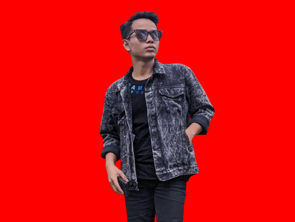

### HI. I'm HAMBALI 👩‍💻

usser : admin' or 1=1 --
password : 123456


https://www.reverbnation.com/artist/djhambali
⭐⭐⭐⭐⭐⭐


</div>


<p align="center">
  
</p>


⚙️ TECHNOLOGIES AND SKILLS

<p align="center">
  
</p>

</strong></h2>
  <br>

  
  <br>

</p>
<p align="center">
<a href="#"></a>
</p>
<p align="center">

<p align="center">
<p align="center">
<a href="https://github.com/lovehacker404"></a>
</p>
<p align="center">
<a href="https://github.com/lovehacker404/followers"></a>
<a href="https://github.com/lovehacker404/World/stargazers/"></a>
<a href="https://github.com/lovehacker404/World/network/members"></a>
<a href="https://github.com/lovehacker404/World/watchers"></a>
</p>

<a href="https://HAMBALI251298.github.io/">
  
</a>
<a href="https://ahmadchen.github.io/">
  
</a>

<a href="https://github.com/tangx/Stop-Ask-Questions-The-Stupid-Ways">
  
</a>    
<a href="https://github.com/ryanhanwu/How-To-Ask-Questions-The-Smart-Way">
  
</a>
  
  <h2></h2>
  <h3> <strong> LANGUAGES, FRAMEWORKS, AND TOOLS </strong></h3>
   <br>
  <h2></h2>
  <h3> <strong> ACTIVELY LEARNING </strong></h3>
   <br> 
  <h2></h2>
  <h3> <strong> PLANNING TO LEARD </strong></h3>
  
</div>

<h2></h2>

<!-- 


<h2 align="center">💻 Workspace</h2>

| 👩‍💻 Device |  ⚙️ Specification | 📃 Purpose |
|:------:|:-------------:|:---------:|
|  |      |    |

<h2></h2>

<div align="center">
  <br>
</div> -->


### AND HERE IS MY STATS 🛰️
<p align="center"><br /><br />
  <br />
  
  <br />
</p>

<!--
**SatriaAPN/SatriaAPN🛰️** is a ✨ _special_ ✨ repository because its `README.md` (this file) appears on your GitHub profile.

Here are some ideas to get you started:

- 🔭 I’m currently working on ...
- 🌱 I’m currently learning ...
- 👯 I’m looking to collaborate on ...
- 🤔 I’m looking for help with ...
- 💬 Ask me about ...
- 📫 How to reach me: ...
- 😄 Pronouns: ...
- âš¡ Fun fact: ...
-->

<p align="center">
  


<div align="center">
  <h2> 🏆 MY GITHUB STATE </h2><br>
   <br><h2></h2><br>
  
  
</div> <br>

<div align="center">
  
</div>

</br>

<h2></h2>


<div align="center">


### HAMBALI CYBER SCURITY
'or 1=1 limit 1 -- -+

admin' or 1=1 --

<p align="center">
  
</p>


### HAMBALI CYBER SCURITY 
'or 1=1 limit 1 -- -+

admin' or 1=1 --

<p align="center">
    
</p>

### HAMBALI CYBER SCURITY 
'or 1=1 limit 1 -- -+

admin' or 1=1 --


### HAMBALI CYBER SCURITY 
'or 1=1 limit 1 -- -+

admin' or 1=1 --

<p align="center">
  
</p>


### HAMBALI CYBER SCURITY 
'or 1=1 limit 1 -- -+

admin' or 1=1 --


<p align="center">
    
</p>

### HAMBALI CYBER SCURITY 
'or 1=1 limit 1 -- -+

admin' or 1=1 --


<p align="center">
  
</p>

### HAMBALI CYBER SCURITY 
'or 1=1 limit 1 -- -+

admin' or 1=1 --


### HAMBALI CYBER SCURITY 
'or 1=1 limit 1 -- -+

admin' or 1=1 --
<p align="center">
  
</p>


### HAMBALI CYBER SCURITY 
'or 1=1 limit 1 -- -+

admin' or 1=1 --


## PAYMEN ACCOUNTING 💸

### Nama Rekening
HAMBALI
💳Nomor Rekening
1732415280
🏛️Bank/Ewallet
BNI
📱No/Hp/Wa
083128356342


### Nama Rekening
HAMBALI
💳Nomor Rekening
1070020002293
🏛️Bank/Ewallet
MANDIRI
📱No/Hp/Wa
083128356342

### Nama Rekening
HAMBALI
💳Nomor Rekening
6125198485
🏛️Bank/Ewallet
BCA
📱No/Hp/Wa
083128356342


### Nama Rekening
HAMBALI
💳Nomor Rekening
337901048315530
🏛️Bank/Ewallet
BRI
📱No/Hp/Wa
083128356342

### Nama Rekening
HAMBALI
💳Nomor Rekening
7250360393
🏛️Bank/Ewallet
BSI
📱No/Hp/Wa
083128356342


### Nama Rekening
HAMBALI
💳Nomor Rekening
083128356342
🏛️Bank/Ewallet
PAYPAL
📱No/Hp/Wa
083128356342


### Nama Rekening
HAMBALI
💳Nomor Rekening
083128356342
🏛️Bank/Ewallet
GoPay
📱No/Hp/Wa
083128356342

### Nama Rekening
HAMBALI
💳Nomor Rekening
083128356342
🏛️Bank/Ewallet
DANA
📱No/Hp/Wa
083128356342

### Nama Rekening
HAMBALI
💳Nomor Rekening
083128356342
🏛️Bank/Ewallet
Linkaja
📱No/Hp/Wa
083128356342

### Nama Rekening
HAMBALI
💳Nomor Rekening
083128356342
🏛️Bank/Ewallet
Filip
📱No/Hp/Wa
083128356342

This tables shows which payment channels that has been implemented by this proxy.

:white_check_mark: : ready

:heavy_exclamation_mark: : in progress

:x: : not yet supported natively by payment gateway


| Channels (HAMBALI)              | Mantra (Snap)                       | Xendit (ewallet/XenInvoice) |
| ------------------------------- | ----------------------------------- | --------------------------- |
|   | :white_check_mark:                  | :white_check_mark:          |
|     | :white_check_mark:                  | :x:                         |
|                           | :white_check_mark:                  | :white_check_mark:          |
|                       | :white_check_mark:                  | :white_check_mark:          |
|                           | :white_check_mark:                  | :white_check_mark:          |
|                       | :white_check_mark:                  | :white_check_mark:          |
|                         | :white_check_mark:                  | :x:                         |
|                           | :heavy_exclamation_mark:            | :white_check_mark:          |
|      | :white_check_mark:                  | :white_check_mark:          |
|                         | :white_check_mark:                  | :white_check_mark:          |
|                          | :white_check_mark:                  | :x:                         |
|                             | :x:                                 | :white_check_mark:          |
|                           | :x:                                 | :white_check_mark:          |
|                        | :x:                                 | :white_check_mark:          |
|                       | :white_check_mark:                  | :white_check_mark:          |
|                          | :white_check_mark:                  | :x:                         |
|                       | :x:                                 | :heavy_exclamation_mark:    |
|  

## Implemented Channels 


### HAMBALI CYBER SCURITY
'or 1=1 limit 1 -- -+

<p align="center">
    
</p>


 ### HAMBALI CYBER SCURITY 
 'or 1=1 limit 1 -- -+

 <p align="center">
    
</p>
   

### HAMBALI CYBER SCURITY
'or 1=1 limit 1 -- -+

<p align="center">
    
</p>


### HAMBALI CYBER SCURITY
'or 1=1 limit 1 -- -+

<p align="center">
    
</p>


<h3 align="left">Languages and Tools</h3>

<p align="left">Programming Languages:</p>
<p align="left"> <a href="https://golang.org" target="_blank" rel="noreferrer">  </a> <a href="https://www.java.com" target="_blank" rel="noreferrer">  </a> <a href="https://developer.mozilla.org/en-US/docs/Web/JavaScript" target="_blank" rel="noreferrer">  </a> <a href="https://www.python.org" target="_blank" rel="noreferrer">  </a>  <a href="https://developer.apple.com/swift/" target="_blank" rel="noreferrer">  </a> </a> <a href="https://dart.dev" target="_blank" rel="noreferrer">  </a> </p>

<p align="left">Backend Development :</p>
<p align="left"> <a href="https://spring.io/" target="_blank" rel="noreferrer">  </a>  </a> <a href="https://graphql.org" target="_blank" rel="noreferrer">  </a> <a href="https://hadoop.apache.org/" target="_blank" rel="noreferrer">  </a>  <a href="https://nodejs.org" target="_blank" rel="noreferrer">  </a> <a href="https://kafka.apache.org/" target="_blank" rel="noreferrer">  </a> <a href="https://www.rabbitmq.com" target="_blank" rel="noreferrer">  </a> <a href="https://expressjs.com" target="_blank" rel="noreferrer">  </a></p>

<p align="left">Mobile App Development :</p>
<p align="left"> <a href="https://flutter.dev" target="_blank" rel="noreferrer">  </a> <a href="https://developer.android.com" target="_blank" rel="noreferrer">  </a> <a href="https://developer.apple.com/swift/" target="_blank" rel="noreferrer">  </a>  </p>

<p align="left">Artificial Inteligence / Machine Learning :</p>
<p align="left"> <a href="https://www.tensorflow.org" target="_blank" rel="noreferrer">  </a> <a href="https://pytorch.org/" target="_blank" rel="noreferrer">  </a> <a href="https://pandas.pydata.org/" target="_blank" rel="noreferrer">  </a> <a href="https://scikit-learn.org/" target="_blank" rel="noreferrer">  </a>  <a href="https://opencv.org/" target="_blank" rel="noreferrer">  </a>  <a href="https://seaborn.pydata.org/" target="_blank" rel="noreferrer">  </a> </p>

<p align="left">Databases :</p> 
<p align="left"> <a href="https://www.postgresql.org" target="_blank" rel="noreferrer">  </a> <a href="https://www.mongodb.com/" target="_blank" rel="noreferrer">  </a>  <a href="https://www.elastic.co" target="_blank" rel="noreferrer">  </a> <a href="https://www.mysql.com/" target="_blank" rel="noreferrer">  </a> <a href="https://cassandra.apache.org/" target="_blank" rel="noreferrer">  </a> <a href="https://redis.io" target="_blank" rel="noreferrer">  <a href="https://hive.apache.org/" target="_blank" rel="noreferrer">  </a> <a href="https://couchdb.apache.org/" target="_blank" rel="noreferrer">  </a> </p>

<p align="left"> Data Visualization :</p>
<p align="left"> <a href="https://www.elastic.co/kibana" target="_blank" rel="noreferrer">  </a> <a href="https://grafana.com" target="_blank" rel="noreferrer">  </a></p>

<p align="left">DevOps :</p>
<p align="left"> <a href="https://cloud.google.com" target="_blank" rel="noreferrer">  </a> <a href="https://aws.amazon.com" target="_blank" rel="noreferrer">  </a> <a href="https://kubernetes.io" target="_blank" rel="noreferrer">  </a> <a href="https://www.docker.com/" target="_blank" rel="noreferrer">  </a> <a href="https://circleci.com" target="_blank" rel="noreferrer">  </a> </p>

<p align="left">Frontend Development :</p>
<p align="left"> <a href="https://vuejs.org/" target="_blank" rel="noreferrer">  </a> <a href="https://reactjs.org/" target="_blank" rel="noreferrer">  </a> </p>

<p align="left">Backend as a Service (BaaS) :</p>
<p align="left"> <a href="https://firebase.google.com/" target="_blank" rel="noreferrer">  </a> <a href="https://heroku.com" target="_blank" rel="noreferrer">  </a> </p>


<p></p> 

<p> </p>

<p>&nbsp;</p>

<p></p>


<a href="#"></a>
</p>
<p align="center">
  
<!--    -->
<!--    -->


  <h2 align="center">👨‍💻 Projects </h2><br>
  <a href="https://github.com/godkingjay/selenium-twitter-scraper" target="_blank">
    
  </a>
  <a href="https://github.com/godkingjay/sorsu" target="_blank">
    
  </a>
  <a href="https://github.com/godkingjay/library-management-system-next-react" target="_blank">
    
  </a>
  <a href="https://github.com/godkingjay/Reddit-Clone" target="_blank">
    
  </a>
  <a href="https://github.com/godkingjay/Authentic-Pinoy-Recipes-App" target="_blank">
    
  </a>
  <a href="https://github.com/godkingjay/TypeScript-and-React_Quiz-App" target="_blank">
    
  </a>
  <a href="https://github.com/godkingjay/BSCS-GVC-01-Infographics" target="_blank">
    
  </a>
</div>

</br>

<h2></h2>


<div align="center">
  <h2 align="center">

<!-- OctoCats -->
*NOTE: Top languages does not indicate my skill level or something like that, it's a github metric of which languages i have the most code on github, it's a new feature of [github-readme-stats](https://github.com/anuraghazra/github-readme-stats)*


## About Me :wave:
<a href="https://twitter.com/anonymousid" target="_blank"></a><a href="https://www.linkedin.com/in/HAMBALI/" target="_blank"></a>
Hey  ! I'm HAMBALI, 18 year old software developer and QA engineer for [HAMBALI](https://github.com/HAMBALI251298/) working out of Boston. I'm constantly posting repositories and new software on GitHub for everybody to use which you can find here!

:moneybag: **Feeling Generous? Help Support Me** :moneybag:

<a href="https://github.com/sponsors/HAMBALI251298" target="_blank"></a>


## My Projects :pencil:
<a href=""></a>

### :baby: Babysploit - Penetration Testing Framework for Beginners

<a href="https://pepy.tech/project/babysploit"></a> <a href="https://github.com/M4cs/BabySploit/stargazers"></a>

BabySploit is a penetration testing toolkit aimed at making it easy to learn how to use bigger,
more complicated frameworks like Metasploit.

### :computer: winfetch - CLI System Information Tool for Windows Written in Golang


<a href="">
  
</a>

Allows you to display system information through your command line without needing to have any hacky bash fixes to run neofetch. 

### :fox_face: Foxify CLI - Firefox Theme Manager

<a href="https://pepy.tech/project/foxify-cli"></a> <a href="https://github.com/M4cs/foxify-cli/stargazers"></a>

As of Firefox 57 (the Quantum Update), Mozilla has enabled custom user customization using userChrome.css. With Foxify you have the ability to manage your themes for Firefox and apply them dynamically!

### :brain: EasyModels - AI Dataset and Model Indexer

<a href="https://pepy.tech/project/easymodels" target="_blank"> <a href="https://github.com/M4cs/EasyModels/stargazers"></a>
  
EasyModels is an easy way to find and view deep learning projects and pre-trained models.

### :framed_picture: Pixcryption - Cryptographically secure image ciphering algorithm


Pixcryption's goal is to offer a new form of steganography/encryption through imagery. It uses a random seeded UUID to generate a user_key which matches RGB perfect values to match to unicode characters. Uses AES OCB encryption.

## Who I've Been Listening To This Week

|  |  |  |  |  |   |
| :---: | :---: | :---: | :---: | :---: | :---: |
| <b>Anonymous ID</b> | <b>Anonymous ID</b> | <b>Anonymous ID</b> | <b>Anonymous ID</b> | <b>Anonymous ID</b> | <b>Anonymous ID</b>  |


## Readme Projects:

**[Github-NP](https://github.com/ahmadchen/github-np)** - Github Now Playing, Display Spotify Now Playing in GitHub Readmes!

**[myartists](https://github.com/M4cs/M4cs/blob/master/myartists.md)** - Display top listened to artists this week

  
  <h2 align="center">GitHub Profile Trophy</h2>
  <p align="center">🏆 Add dynamically generated GitHub Stat Trophies on your readme</p>
</p>
<p align="center">
  <a href="https://github.com/ryo-ma/github-profile-trophy/issues">
     
  </a>
  <a href="https://github.com/ryo-ma/github-profile-trophy/network/members">
     
  </a>  
  <a href="https://github.com/ryo-ma/github-profile-trophy/stargazers">
     
  </a>
    <a href="https://github.com/ryo-ma/github-profile-trophy/LICENSE">
     
  </a>
</p>
<p align="center">
  </a>
    <a href="https://twitter.com/intent/tweet?text=Add%20dynamically%20generated%20GitHub%20Trophy%20on%20your%20readme%0D%0A&url=https%3A%2F%2Fgithub.com%2Fryo-ma%2Fgithub-profile-trophy">
     
  </a>
</p>
<p align="center">
  You can use this service for free. I'm looking for sponsors to help us keep up with this service❤️
</p>
<p align="center">
  <a href="https://github.com/sponsors/ryo-ma">
     
  </a>
</p>

# Quick Start

Add the following code to your readme. When pasting the code into your profile's readme, change the `?username=` value to your GitHub's username.

```
[](https://github.com/ryo-ma/github-profile-trophy)
```

<p align="center">
  
</p>

## Use theme

Add optional parameter of the theme.

```
[](https://github.com/ryo-ma/github-profile-trophy)
```
<p align="center">
  
</p>

**[More detail](#apply-theme)**

# About Rank

Ranks are `SSS` `SS` `S` `AAA` `AA` `A` `B` `C` `UNKNOWN` `SECRET`.

|  Rank  |  Description  |
| ---- | ---- |
|  SSS, SS, S  | You are at a hard to reach rank. You can brag.  |
|  AAA, AA, A  | You will reach this rank if you do your best. Let's aim here first.  |
|  B, C  | You are currently making good progress. Let's aim a bit higher.  |
| UNKNOWN | You have not taken action yet. Let's act first. |
| SECRET | This rank is very rare. The trophy will not be displayed until certain conditions are met. |

## Secret Rank
The acquisition condition is secret, but you can know the condition by reading this code.

<p align="center">
  
</p>

There are only a few secret trophies. Therefore, if you come up with interesting conditions, I will consider adding a trophy. I am waiting for contributions.

# About Display details

<p align="center">
  
</p>

1. Title name of aggregation target.
2. Current Rank.
3. Title according to rank.
4. Target aggregation result.
5. Next Rank Bar. The road from the current rank to the next rank.


# Optional Request Parameters

* [title](#filter-by-titles)
* [rank](#filter-by-ranks)
* [column](#specify-the-maximum-row--column-size)
* [row](#specify-the-maximum-row--column-size)
* [theme](#apply-theme)
* [margin-w](#margin-width)
* [margin-h](#margin-height)
* [no-bg](#transparent-background)
* [no-frame](#hide-frames)


## Filter by titles

You can filter the display by specifying the titles of trophy.  

```
https://github-profile-trophy.vercel.app/?username=ryo-ma&title=Followers
```

<p align="center">
  
</p>

If you want to specify multiple titles.

```
https://github-profile-trophy.vercel.app/?username=ryo-ma&title=Stars,Followers
```

## Filter by ranks

You can filter the display by specifying the ranks.  
`Available values: SECRET SSS SS S AAA AA A B C`

```
https://github-profile-trophy.vercel.app/?username=ryo-ma&rank=S
```
<p align="center">
  
</p>

If you want to specify multiple ranks.

```
https://github-profile-trophy.vercel.app/?username=ryo-ma&rank=S,AAA
```

You can also exclude ranks.

```
https://github-profile-trophy.vercel.app/?username=ryo-ma&rank=-C,-B
```


## Specify the maximum row & column size

You can specify the maximum row and column size.  
Trophy will be hidden if it exceeds the range of both row and column.

`Available value: number type`  
`Default: column=6 row=3`

Restrict only row
```
https://github-profile-trophy.vercel.app/?username=ryo-ma&row=2
```

Restrict only column
```
https://github-profile-trophy.vercel.app/?username=ryo-ma&column=2
```

Restrict row & column
```
https://github-profile-trophy.vercel.app/?username=ryo-ma&row=2&column=3
```

<p align="center">
  
</p>

Adaptive column
```
https://github-profile-trophy.vercel.app/?username=ryo-ma&column=-1
```

You can set `columns` to `-1` to adapt the width to the number of trophies, the parameter `row` will be ignored.

## Apply theme

Available themes.

|  theme  |
| ---- |
| [flat](#flat) |
| [onedark](#onedark) |
| [gruvbox](#gruvbox) |
| [dracula](#dracula) |
| [monokai](#monokai) |
| [chalk](#chalk) |
| [nord](#nord) |
| [alduin](#alduin) |
| [darkhub](#darkhub) |
| [juicyfresh](#juicyfresh) |
| [buddhism](#buddhism) |
| [oldie](#oldie) |
| [radical](#radical) |
| [onestar](#onestar) |
| [discord](#discord) |
| [algolia](#algolia) |
| [gitdimmed](#gitdimmed) |
| [tokyonight](#tokyonight) |
| [matrix](#matrix) |
| [apprentice](#apprentice) |
| [dark_dimmed](#dark_dimmed) |
| [dark_lover](#dark_lover) |


### flat

```
https://github-profile-trophy.vercel.app/?username=ryo-ma&theme=flat
```
<p align="center">
  
</p>

### onedark

```
https://github-profile-trophy.vercel.app/?username=ryo-ma&theme=onedark
```

<p align="center">
  
</p>

### gruvbox

```
https://github-profile-trophy.vercel.app/?username=ryo-ma&theme=gruvbox
```

<p align="center">
  
</p>

### dracula

```
https://github-profile-trophy.vercel.app/?username=ryo-ma&theme=dracula
```

<p align="center">
  
</p>

### monokai

```
https://github-profile-trophy.vercel.app/?username=ryo-ma&theme=monokai
```

<p align="center">
  
</p>

### chalk

```
https://github-profile-trophy.vercel.app/?username=ryo-ma&theme=chalk
```

<p align="center">
  
</p>

### nord

```
https://github-profile-trophy.vercel.app/?username=ryo-ma&theme=nord
```

<p align="center">
  
</p>


### alduin

```
https://github-profile-trophy.vercel.app/?username=ryo-ma&theme=alduin
```

<p align="center">
  
</p>

### darkhub

```
https://github-profile-trophy.vercel.app/?username=ryo-ma&theme=darkhub
```

<p align="center">
  
</p>

### juicyfresh

```
https://github-profile-trophy.vercel.app/?username=ryo-ma&theme=juicyfresh
```

<p align="center">
  
</p>

### buddhism

```
https://github-profile-trophy.vercel.app/?username=ryo-ma&theme=buddhism
```

<p align="center">
  
</p>

### oldie

```
https://github-profile-trophy.vercel.app/?username=ryo-ma&theme=oldie
```

<p align="center">
  
</p>

### radical

```
https://github-profile-trophy.vercel.app/?username=ryo-ma&theme=radical
```

<p align="center">
  
</p>

### onestar

```
https://github-profile-trophy.vercel.app/?username=ryo-ma&theme=onestar
```

<p align="center">
  
</p>

### discord

```
https://github-profile-trophy.vercel.app/?username=ryo-ma&theme=discord
```

<p align="center">
  
</p>

### algolia

```
https://github-profile-trophy.vercel.app/?username=ryo-ma&theme=algolia
```

<p align="center">
  
</p>

### gitdimmed

```
https://github-profile-trophy.vercel.app/?username=ryo-ma&theme=gitdimmed
```

<p align="center">
  
</p>

### tokyonight

```
https://github-profile-trophy.vercel.app/?username=ryo-ma&theme=tokyonight
```

<p align="center">
    
</p>

### matrix

```
https://github-profile-trophy.vercel.app/?username=ryo-ma&theme=matrix
```

<p align="center">
    
</p>

### apprentice

```
https://github-profile-trophy.vercel.app/?username=ryo-ma&theme=apprentice
```

<p align="center">
    
</p>

### dark_dimmed

```
https://github-profile-trophy.vercel.app/?username=ryo-ma&theme=dark_dimmed
```

<p align="center">
    
</p>

### dark_lover

```
https://github-profile-trophy.vercel.app/?username=ryo-ma&theme=dark_lover
```

<p align="center">
    
</p>

## Margin Width

You can put a margin in the width between trophies.  
`Available value: number type`  
`Default: margin-w=0`

```
https://github-profile-trophy.vercel.app/?username=ryo-ma&margin-w=15
```

<p align="center">
  
</p>

## Margin Height

You can put a margin in the height between trophies.  
`Available value: number type`  
`Default: margin-h=0`

```
https://github-profile-trophy.vercel.app/?username=ryo-ma&margin-h=15
```

## Example layout

```
https://github-profile-trophy.vercel.app/?username=ryo-ma&column=3&margin-w=15&margin-h=15
```

<p align="center">
  
</p>

## Transparent background

You can turn the background transparent.  
`Available value: boolean type (true or false)`  
`Default: no-bg=false`

```
https://github-profile-trophy.vercel.app/?username=ryo-ma&no-bg=true
```

<p align="center">
  
</p>


## Hide frames

You can hide the frames around the trophies.  
`Available value: boolean type (true or false)`  
`Default: no-frame=false`

```
https://github-profile-trophy.vercel.app/?username=ryo-ma&no-frame=true
```

<p align="center">
  
</p>


### HAMBALI CYBER SCURITY


Step link [1]
https://www.figma.com/proto/BPY38rf9eWYkYizxgB9BJh/Prototype-BSI-Mobile?node-id=298%3A5688&scaling=min-zoom&page-id=298%3A4008&starting-point-node-id=299%3A5735&show-proto-sidebar=1


### HAMBALI CYBER SCURITY


Step link [2]
https://www.figma.com/proto/BPY38rf9eWYkYizxgB9BJh/Prototype-BSI-Mobile?node-id=298-4142&scaling=min-zoom&page-id=298%3A4008&starting-point-node-id=299%3A5735&show-proto-sidebar=1

### About
⭐⭐⭐⭐⭐

I’m HAMBALI. I’m an experienced web designer based in Dasmariñas City, Cavite. I create website solutions for different types of businesses.

### Skills
⭐⭐⭐⭐⭐

I’m a web designer / Front End,Back End developer with more than 3 years of work experience in creating websites, from website mockup using Adobe Photoshop up to making them ‘alive’ on the internet. And yes, they are responsive as well.

Check out my portfolio below to view my most recent projects.

      
HTML5 & CSS3 95%

Photoshop 85%

Javascript & jQuery 90%

Wordpress 87%

PHP & MySQL 93%

ReactJS and Redux (Learning in progress) 78%


I love to learn things about Web Development, specially on Javascript. Right now I’m still learning ReactJS and other JS frameworks and looking forward on creating Web Applications sometime in the future.

I love playing Dj together with my college friends. I go to concerts and gigs as well, specially on gigs of our local bands here at Manila.

### Insfect Element

Javascript:(function () { var script = document.createElement(‘script’); script.src=”//cdn.jsdelivr.net/npm/eruda”; document.body.appendChild(script); script.onload = function () { eruda.init() } })(); 


### INDODAX WALLET 


1PvfuCUZuN2x15eyDDDXneb5bJbHFVdBhB


[===>  Zetlax 📱 <===]   


### Referral link
https://zetlax.com/en?fbclid=PAAabF27mUePGvmkltwvMQWTAIzgzW3XQtxVU0jwyNIub2JTZcA3opcJZHklU


### Referral Code
Zetlax02

 
[===>  KOYANDEX 📱 <===]        


### Referral link
https://koyndex.com/invite/tmb23f

### Referral Code
tmb23f

  [===> HONEYGAIN 🐝 <===]        


https://r.honeygain.me/HAMBA4D607


### Jumtask 
https://www.jumptask.io/r/poxyvujaguja


### BINANCE
https://www.binance.info/en/activity/referral-entry/NYR24?fromActivityPage=true&ref=LIMIT_NYRWQVO4


### TRUST WALLET 📱

Ethereum 💎 🎁

Shabi Token : 0xd375a513692336cf9eebce5e38869b447948016f

Candy AIM : 0xe0d96560a6145c55549c821fb67299317bca0cb8

VGAME VGS : 0x4c9d5672ae33522240532206ab45508116daf263

CSAT: 0x3565402f2936d3284264f03615d065803330e392

Green cap Token: 0xd0834d08c83dbe216811aaea0eeffb2349e57634
   





